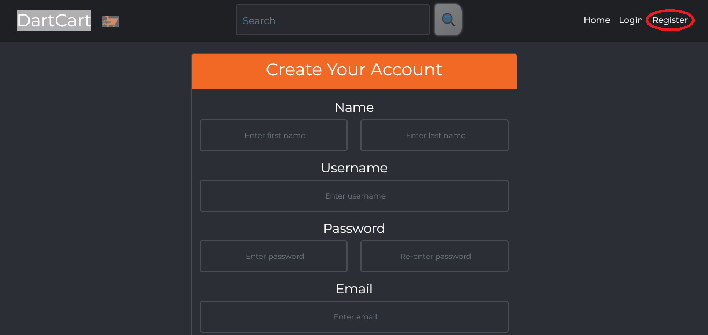
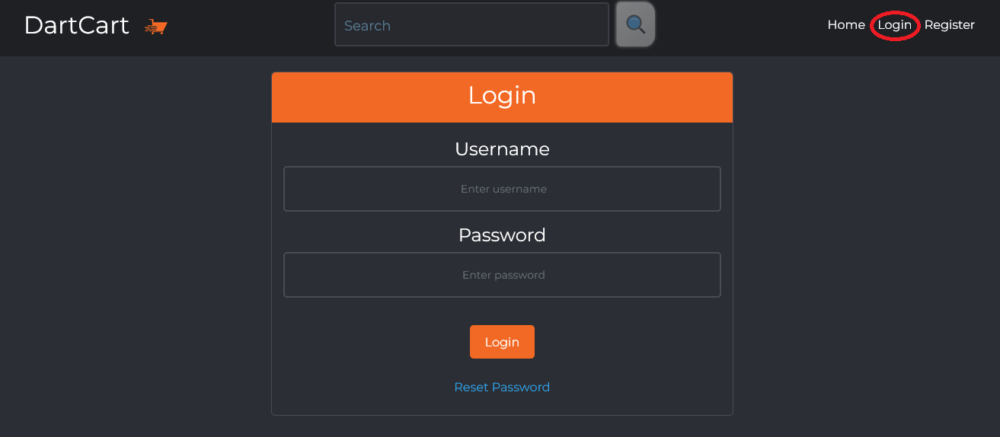
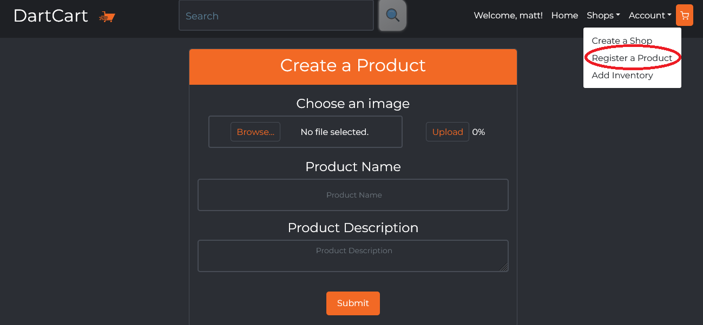
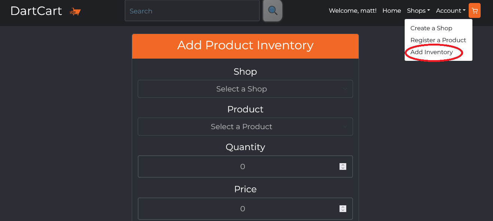
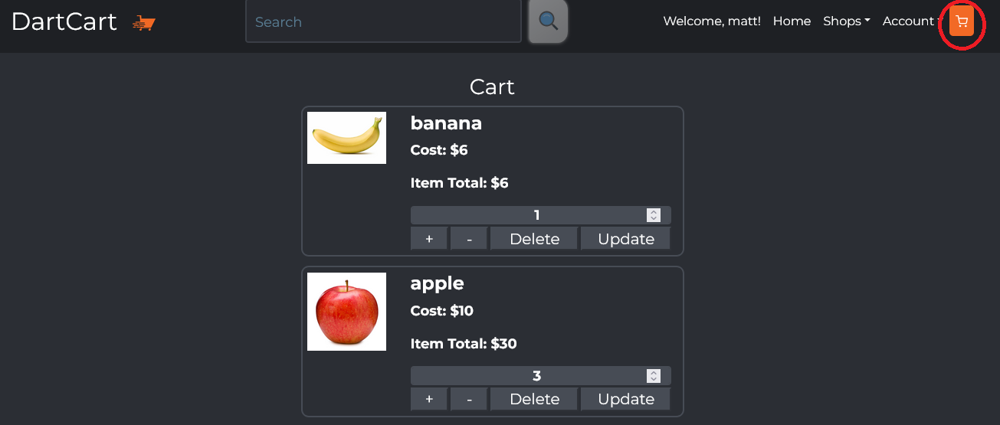
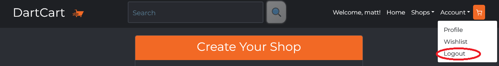

# DartCart-Client
Note: This is the front-end portion of the DartCart Application. The required back-end portion can be found here: https://github.com/Revature-DartCart-3/DartCart-Server

## Project Description
 
DartCart is an e-commerce web application designed to buy and sell products developed with Full Stack Development. The Client-side section of DartCart represents the front-end side, where Users can interact with the application and is written using TypeScript and React.

## Technologies Used

* TypeScript
* Node
* React
  * React Router
  * React Bootstrap
  * React Testing Library
* Redux
* Axios

## Features

* Create and Login with an Account.
* Browse for products by Type, Category, and Supplier.
* Add items to your cart and checkout items.
* Choose different payment plans at checkout.
* Add items to be sold onto the market.
* View previous order and transaction details.
* Leave reviews for products.
* Live tech support chat.

## Getting Started

The first step is to clone the Client repo. To do this, open a git bash window in the folder you wish to save the project and run the following command using this link:

$ git clone https://github.com/Revature-DartCart-3/DartCart-Client.git

Next, you must go to https://nodejs.org/en/?msclkid=e1737570a88911ec9b5ea557841437a2 and complete the download process.

Now that you have everything you need on your computer, open a git bash window in the data-cart-client folder.

and run the command "npm install"

In the same directory:

### `npm start`

Runs the app in the development mode. 
Open [http://localhost:3000](http://localhost:3000) to view it in the browser.

The page will reload if you make edits. 
You will also see any lint errors in the console.

Your browser will automaticall open for you, and you are all set.

## Usage

> Here is a guide to using the DartCart app.

* Homepage
  * This is DartCart's landing page. On this page you can view featured products and choose between light and darkmode with the switch at the top.
  

* Register
  * Register a new user by clicking the Register button and fill out the new account registration form.
  

* Login
  * Once a user is registered, they are automaticly logged in to the app. On subsequent visits the user must login before they can use the app.
  

* Create a Shop
  * If the user is wanting to sell products on DartCart, a shop can be made by clicking the Create a Shop button and filling out the registration form.
  
  
* Add Products
  * Once a shop is created, items can be added to the shop with a corresponding image, name and description.
  

* Add inventory
  * Once there are products in a shop, the amount of the items to sell and any discounts can be applied.
  

* Cart
  * Once a user has decided which items to purchase they can proceed to their cart. Here the user has the options of increasing or lowering the quantity of the items they wish to purchase. To save this quantity the update button must be clicked. If a user wishes to remove an item from their cart they can click the delete button.
  

* Checkout
  * After a user has decided on what to purchase they can then proceed to checkout. Relevant information such as shipping address and a credit card must be entered along with the desired payment plan.
  * ADD IMAGE OF CHECKOUT

* Tech Support Chat
  * If at any time a user has problems with the site there is a tech support chat to reach an employee for help.
  * ADD IMAGE OF TECH SUPPORT CHAT

* Logout
  * When the user leaves the app, be sure to close the connection to their account by clicking the Logout button.
  
  

## Contributors of first iteration (DartCart 1)

* Abdul Samad Sadat
* Alejandro Gomez
* Anthony Davis
* Artur Weinstein
* Ben Karlsberg
* Candido Ramirez
* Clyde Griffin
* David Melanson Jr
* Dom Scanga
* Jack Linhart
* John Salguero
* Josh Harms
* Joshua Herrera
* Kainalu Barino
* Leland Warner
* Michael Ord
* Richard Simpson
* Robert Davis
* Ryan Haque
* Tanner Nielsen
* Thanh Nguyen
* Tomas Abebaw Anbessaw

## Contributers of second iteration (DartCart 2)

* Andy Escobar
* Andrew Snyder
* Austin Ristau
* Hannah Hospital
* Austin McGehee
* Austin Blandford
* Awaab Elamin
* Brandon Clark
* Michael Bronzo
* Christian Mains
* Philip Wentworth
* Gurman Singh
* Jacob Sotto
* Paul Agilpay
* Mike Campbell
* Lamar Lewis
* Robert Lavoie
* Scott Damon
* Tracy Bodine
* Joshua Robles
* Joshua Evans

Dart Cart 2 was made for the Revature Java/React 1/24 batch

## Contributers of third iteration (DartCart 3)

* Caitlin Cassidy
* Donald Lopez
* Daun Kim
* Desiree Steffen
* Drael Davidson
* Eric Vara
* Fatima Baloch
* Gino Townsend
* Hunter Risse
* Kalvin McClure
* Madison Schweikert
* Marquel Ellis
* Matthew Kott
* Matthew Nevish
* Megan Orth
* Mellownee Floyd
* Rosa Gutierrez
* Samuel Sholib
* Shabana Mehr
* Stefan Riley
* Uyenvy Nguyen

Dart Cart 3 was made for the Revature Java/React 3/7 batch
